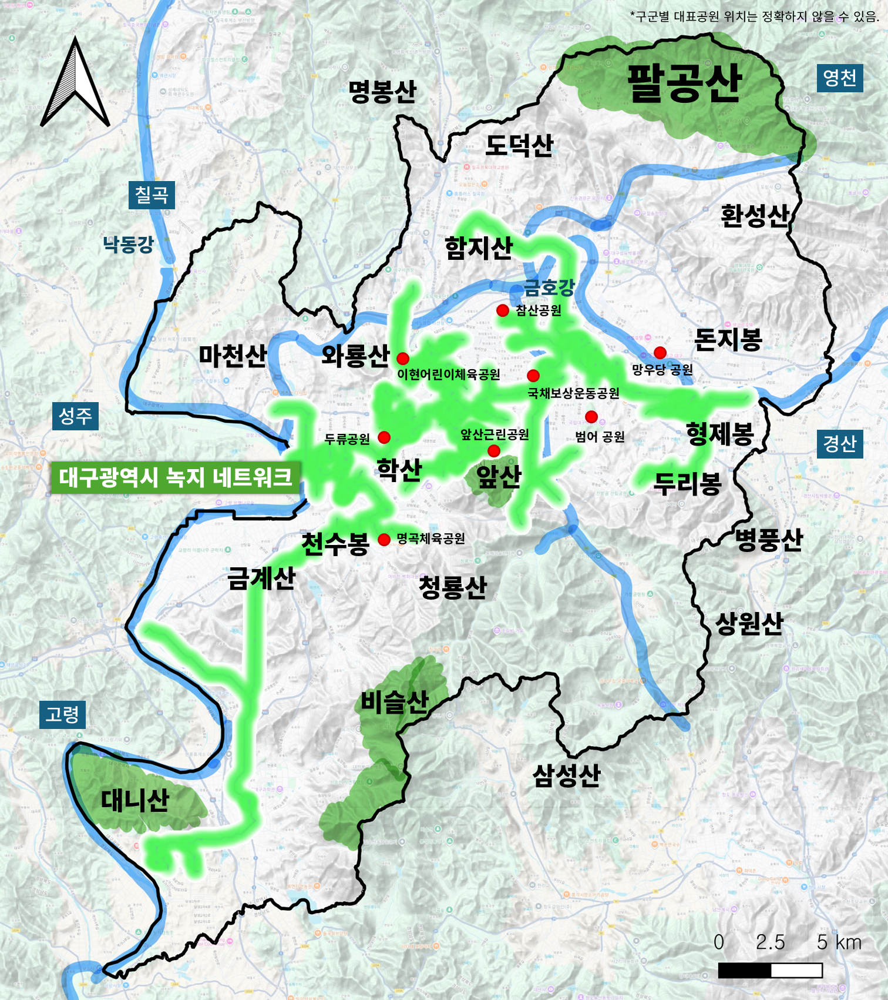
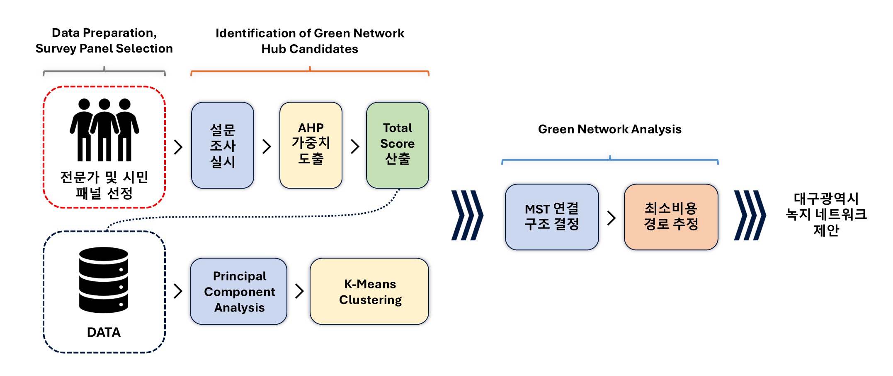
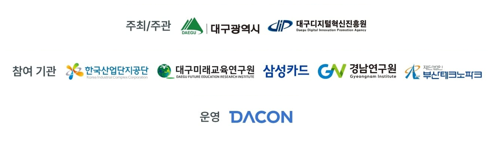

<h6>제7회 대구 빅데이터 분석 경진대회</h6>

<h1>대구광역시 녹지 네트워크 우선 입지 선정</h1>

    
    <a href='https://www.linkedin.com/in/jeong-jun-park/' target='_blank'>박정준</a>1&nbsp&nbsp&nbsp&nbsp;
    <a href='https://www.instagram.com/wonehyy/' target='_blank'>김혜원</a>2&nbsp&nbsp&nbsp&nbsp;

 

    1경상국립대학교 AI정보공학과

    2부산대학교 사회학과

    <h4 align="center">
        </a>
        
        
        
    </h4>

---

이 저장소는 <b>“녹지 네트워크 구축을 위한 최적 입지 선정”</b>을 위한 분석 결과 보고서의 기반 코드 및 자료를 제공한다. 기후변화와 열섬현상에 대응하기 위해 대구 도심 내 시민 체감 기반의 녹지 네트워크 구축 최적 입지를 데이터 분석(계층분석법 · 군집화 · 최소신장트리)으로 도출하고, 이를 연결하는 효율적 경로와 정책적 활용 방안을 제시하였다.

|  |
|:--:| 
| **대구광역시 녹지 네트워크 종합 구상도** |

## 분석방법

|  |
|:--:| 
| **전체 분석 흐름도** |

---

## 📧 뉴스
- **2025년 10월 16일:** 본선 발표 평가
- **2025년 10월 13일:** 최종 분석 보고서 제출
- **2025년 10월 12일:** 이 저장소 생성

---
 

|  |
|:--:| 
| **제7회 대구 빅데이터 분석 경진대회 배너** |

