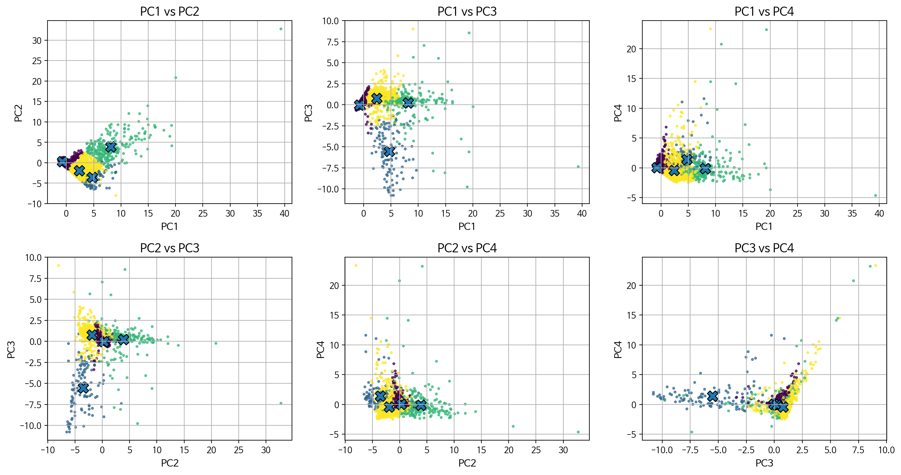

<h6>7th Daegu Big Data Analysis Competition, Team Green Daegu</h6>

<h1>대구광역시 녹지 네트워크 우선 입지 선정</h1>

    
    <a href='https://www.linkedin.com/in/jeong-jun-park/' target='_blank'>박정준</a>1&nbsp&nbsp&nbsp&nbsp;
    <a href='https://www.instagram.com/wonehyy/' target='_blank'>김혜원</a>2&nbsp&nbsp&nbsp&nbsp;

 

    1경상국립대학교 AI정보공학과

    2부산대학교 사회학과

    <h4 align="center">
        </a>
        
        
        
    </h4>

---

이 저장소는 <b>“녹지 네트워크 구축을 위한 최적 입지 선정”</b>을 위한 분석 결과 보고서의 기반 코드 및 자료를 제공한다. 기후변화와 열섬현상에 대응하기 위해 대구 도심 내 시민 체감 기반의 녹지 네트워크 구축 최적 입지를 데이터 분석(계층분석법 · 군집화 · 최소신장트리)으로 도출하고, 이를 연결하는 효율적 경로와 정책적 활용 방안을 제시하였다.

|  |
|:--:| 
| **대구광역시 녹지 네트워크 종합 구상도** |

## 분석방법

|  |
|:--:| 
| **전체 분석 흐름도** |

---

## 📧 뉴스
- **2025년 10월 16일:** 본선 발표 평가
- **2025년 10월 13일:** 최종 분석 보고서 제출
- **2025년 10월 12일:** 이 저장소 생성

---

## 분석결과

|  |
|:--:| 
| **K-Means Clustering(k=4) 결과** |

|  |
|:--:| 
| **군집별 상위 200개 지역 시각화** |

|  |
|:--:| 
| **대구광역시 일대 녹지 네트워크 시각화** |

## 정책제안

| 우선순위 | 최종점수 | 군집 | 위치 | 비고 |
|:--------:|:--------:|:----:|:------------------------:|:---------------------------:|
| 1 | 0.652 | 3 | 서구 이현동 284-3 | 서대구역 부근 |
| 2 | 0.650 | 2 | 달서구 상인동 81 | 상인역 부근 |
| 3 | 0.649 | 1 | 남구 현충로39길 1-2 | 명덕역 부근 |
| 4 | 0.636 | 2 | 동구 신암남로 169 | 동구청역 |
| 5 | 0.635 | 3 | 중구 달구벌대로 2100 | 반월당역 부근 |
| 6 | 0.626 | 2 | 동구 신암동 85-24 | 대구관광고 부근 |
| 7 | 0.625 | 3 | 동구 동호동 343-35 | 동부경찰서 안심지구대 부근 |
| 8 | 0.611 | 0 | 달서구 신당동 1095 | 계명대역 부근 |
| 9 | 0.611 | 0 | 달성군 현풍읍 중리 519 | 유가읍 행정복지센터 부근 |
| 10 | 0.610 | 0 | 달서구 월암동 218-93 | 선돌공원 부근 |
| 11 | 0.568 | 1 | 서구 달구벌대로 1760 | 두류역 부근 |
| 12 | 0.565 | 1 | 서구 비산동 2007-15 | 트레이더스 홀세일 클럽 비산점 부근 |

**녹지 네트워크 허브 (군집 별 상위 3개)**

 

|  |
|:--:| 
| **대구광역시 녹지 네트워크 정책 제안** |

---

## 감사의 글
함께 노력하고 고생해준 팀원 김혜원에게 고마움을 전합니다. 또한 소중한 시간을 내어 설문 조사와 예선 투표에 참여해 주신 모든 분들, 그리고 늘 응원해 주신 부모님께도 감사드립니다.

본 분석 과제는 『제7회 대구 빅데이터 분석 경진대회』의 일환으로 수행된 결과물입니다.

## 연락처
관련하여 궁금한 사항이 있으신 경우 아래로 연락해 주시기 바랍니다.
    
- 책임자: 박정준 ([LinkedIn](https://www.linkedin.com/in/jeong-jun-park/))
- 이메일: [ioppjj0809@naver.com](mailto:ioppjj0809@naver.com)  

 

